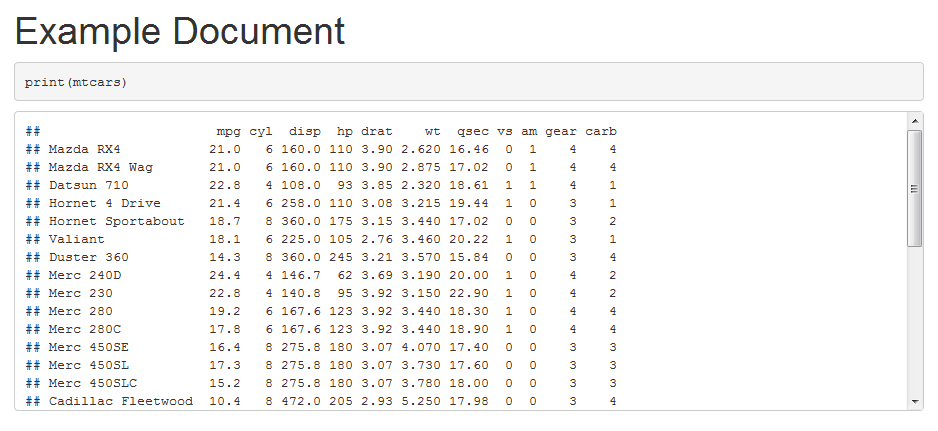

<!-- README.md is generated from README.Rmd. Please edit that file -->
knitrhooks
==========

**knitrhooks** provides useful **knitr** hooks to extend the functionality of **knitr**, **Rmarkdown** and **bookdown**.

Available Hooks
---------------

The below table details the hooks currently available within the package.

| hook name           | description                                 | HTML | PDF |
|---------------------|---------------------------------------------|------|-----|
| `output_lines`      | Print user specified lines of R output      | X    | X   |
| `output_max_height` | Add a scrollbar to output of a given height | X    |     |

Usage
-----

Currently the package requires you to load the functionality of each given hook before you can use it. [Alternative](https://github.com/nathaneastwood/knitrhooks/issues/3) solutions are currently being considered.

<pre>
<code>```{r max_height_example}
library(knitrhooks)
output_max_height()
```</code>

# Example document

<code>```{r output_max_height = "300px"}
print(mtcars)
```</code>
</pre>
The above code will produce the following HTML document.


